# Pro-Loco Supersano

Pro-Loco Supersano is an NGO based in Supersano - Italy, that gathers resourceful members always striving to organize events for the local community. This web-based app lets them have a general overview on events organized so far. Users visiting the website can interact with the content, depending on their admin rights. 

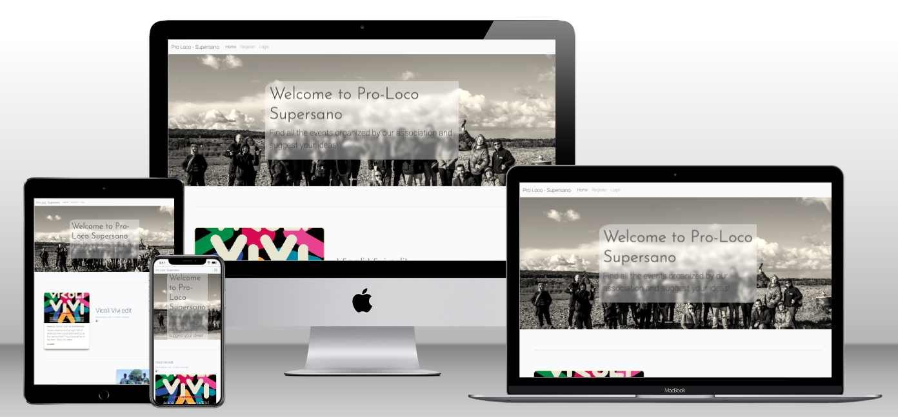

## Table of Contents
* [User Experience Design (UX)](#User-Experience-Design)
    * [The Strategy Plane](#The-Strategy-Plane)
        * [Site Goals](#Site-Goals)
        * [Agile Planning](#Agile-Planning)
          * [User Stories](#User-Stories)
    * [The Scope Plane](#The-Scope-Plan)
    * [The Structure Plane](#The-Structure-Plan)
      * [Features](#Features)
      * [Future Features](#Features-Left-to-Implement)
    * [The Skeleton Plane](#The-Skeleton-Plane)
        * [Wireframes](#Wireframes)
        * [Database Design](#Database-Design)
        * [Security](#Security)
    * [The Surface Plane](#The-Surface-Plane)
        * [Design](#Design)
            * [Colour Scheme](#Colour-Scheme)
            * [Typography](#Typography)
            * [Imagery](#Imagery)
* [Technologies](#Technologies)
* [Testing](#Testing)
* [Deployment](#Deployment)
    * [Version Control](#Version-Control)
    * [Heroku Deployment](#Heroku-Deployment)
    * [Run Locally](#Run-Locally)
    * [Fork Project](#Fork-Project)
* [Credits](#Credits)
  * [Content](#Content)
  * [Acknowledgements](#Acknowledgements)

# User-Experience-Design

## The-Strategy-Plane

### Site-Goals

The site is aimed to give the NGO an online area where to show, organize, cancel local events, that are accessible to people that - otherwise - would not be able to view their events on other platforms. Moreover, as part of their policy, Pro-Loco Supersano also fosters active participation within the local community, turning into a chance to come up with one's suggestions via a dedicated form.

Eventually, users with admin rights (the staff) can approve both messages left on event pages and proposed events.

### Agile Planning

This project was developed using agile methodologies, by delivering small features (issues). Tasks have been prioritized differently - based on their importance.

All issues were assigned to a project, prioritized under the labels, Must have, Should have, Could have, good first issue. They were handled according to complexity. "Must have" stories were completed first, "should haves", "could haves", and "good first issue" seen as features that visiting users would have seen first on the home page - a blend of higher priority and user-oriented experience. It was done this way to ensure that all core requirements were completed first, while additional features enriching the user experience would have been added gradually.

The Kanban board was created using github projects and can be located [here](https://github.com/users/aelfrith92/projects/2/views/1?layout=board). It can be viewed to see more information on the project cards. Some stories have a set of acceptance criteria in order to define the functionality that marks that story as complete. Some other stories do not have acceptance criteria, as they were considered self-explanatory.

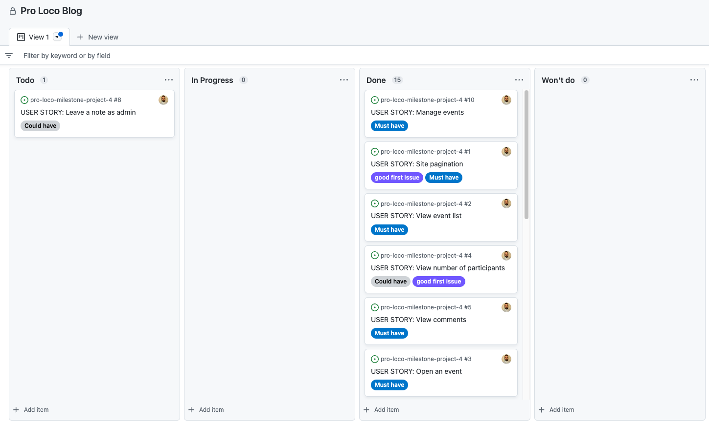

#### User Stories

The following user stories were completed over time. Basic setup stories - such as development-related ones - have been omitted, to prioritize those strictly pertaining the end-user experience. The categories of users described below are "Site User" - meant as a non-authenticated user OR an authenticated user without staff/admin rghts, "admin or privileged user" - meant as an authenticated user, that can be part of the staff. If someone is an admin, but not part of the staff, they may not have access to certain features and might need to access the Django admin overview.

**Customer's statement**

As the president of the association Pro-Loco Supersano, I would like a home page, where members and non-members can find information about our activities and initiatives

**Authentication**

As a Site User I can register an account, so that I can leave comments and my intention to join events

**Pagination and first impression**

As a Site User I can view a list of events with a short preview, so that I can select one to read about

As a Site User I can view a paginated list of events, so that I can easily select an event to view

**Interactions**

As a Site User I can click on an event in the home page, so that I can read about details: whereabouts, whenabouts, etc.

As a Site user I can leave comments on single event pages, so that I can interact with other site users

As a Site user I can join / remove participation to single events, so that I can let other users know that I am going to join an event

As a site user I can receive a notification banner at the top when an action was performed/processed successfully, so that I can have certainty of submitted data

As a Site user I can suggest an event, so that I can feel involved in the local community

As a site authenticated user I can suggest events and get warnings when I am trying to submit an overlapping event, so that I get more chances to see my suggestion approved

**Admin/staff actions**

As a site admin or privileged user (part of the staff) I can edit events, so that I can organize them better.

As a site admin or privileged user (part of the staff) I can delete events, so that get rid of unwanted records in the database.

As a Site Admin I can create, read, update posts, so that I can manage my blog content.

**Documentation**

Tasks:

* Complete readme documentation
* Complete testing documentation write up

## The-Scope-Plan

* Responsive Design - Site should be fully functional on all devices from 320px up
* Hamburger menu for mobile devices
* Ability to perform CRUD functionality on events - admins; Create/Suggest + Read for standard authenticated users
* Restricted role based features
* Home page with list of events

## The-Structure-Plan

### Features

``CUSTOMER'S STATEMENT - As the president (owner) of the association Pro-Loco Supersano, I would like a home page, where members and non-members can find information about our activities and initiatives``

Within the statement, there are a series of taken-for-granted features that should cover essential home page components, such as the navigation menu at the top.

Implementation:

**Navigation Menu**

 The Navigation contains links for Home, allauth options, suggestions (event creation for all authenticated users).

The following navigation items are available on all pages:
  * Home -> index.html - Visible to all
  * Login -> login.html - Visible to logged out users
  * Register -> signup.html - Visible to logged out users
  * Logout -> logout.html - Visible to logged in users
  * Suggest an event -> suggestion.html - Visible to logged in users

The navigation menu is displayed on all pages and drops down into a hamburger menu on smaller devices. This will allow users to view the site from any device and not take up too much space on mobile devices. 

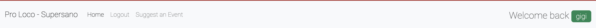

There is a Welcome message on the right side of the navigation bar, which is moved to the bottom on mobile devices burger views:

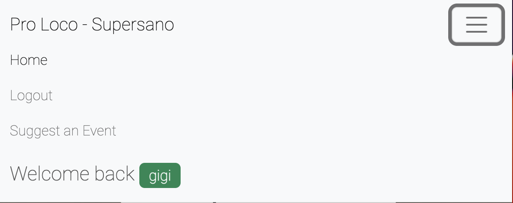

``USER STORY - As a Site User I can view a list of events with a short preview, so that I can select one to read about``

``USER STORY - As a Site User I can view a paginated list of events, so that I can easily select an event to view``

Implementation:

**Home Page**

The home page contains a hero carousel, depicting members of the staff, a local farmer with the picturesque hill behind the dust, and some characters of the movie "La grande guerra del Salento", shot in Supersano. These will give the user an idea about the cultural content available on the website. Each image contains a different message that adds up to the user's initial assumption about the website content and objective.

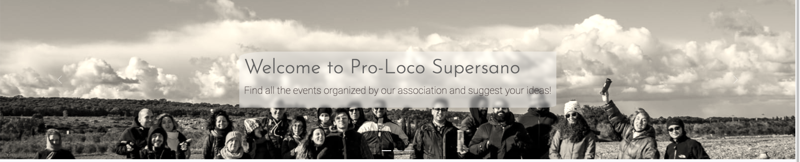

Under the carousel, users can see the list of events that are actually confirmed and scheduled. Pagination options limit them to 6 per page. Example without authentication below:

This is the version of the same list when users are authenticated and marked as part of the staff:

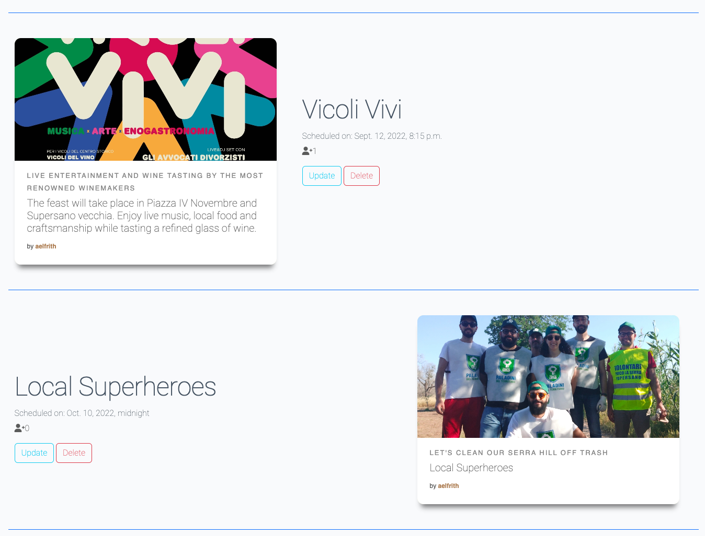

Buttons "Update" and "Delete" can be viewed attached to each event by staff users only.

**Footer**

A footer has been added to the bottom of the site, this contains Youtube, Instagram, and Facebook links so that users can follow the restaurant on social media if they want to keep up to date with updates. These icons have aria-labels added to ensure users with assistive screen reading technology know what the purpose of the links are for. They also open in new tabs as they lead users away from the site.

At the bottom, presence on social networks can be found:

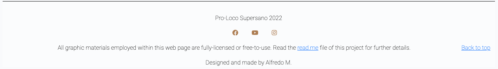

``USER STORY - As a Site User I can register an account, so that I can leave comments and my intention to join events``

**Registration**

If visiting users wish to add their participation to events, comment, or suggest new ideas for future events, it can be done by registering first. Once the link "Register" on the nav menu is clicked, the public user is redirected to the registration form:

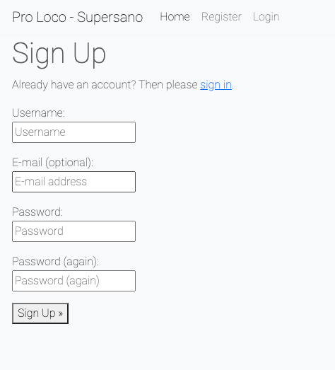

The user will need to enter a unique username to sign up successfully, as well as an acceptable password with minimum security requirements - i.e. it cannot be set to "temporary".

``USER STORY - As a Site User I can click on an event in the home page, so that I can read about details: whereabouts, whenabouts, etc.``

**View Event Details**

Public users can click on events and view their dedicated page: The small poster picture employed in the home page is here extended to a larger image combined with the event details:

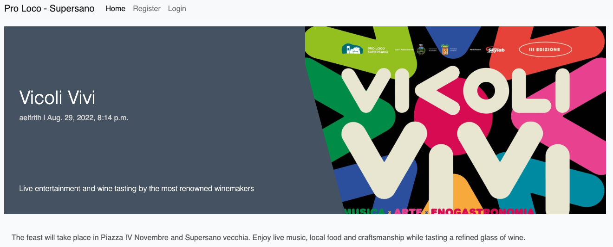

Event information will include date, time, short description (text preview/summary), description, picture.

``USER STORY - As a Site user I can join / remove participation to single events, so that I can let other users know that I am going to join an event``

**Join/Unjoin Event Button**

Authenticated users can let the staff know that they are going to join the event, by clicking/tapping on the related icon wit the "+" (plus) sign:

As soon as the button is clicked, it changes its form to the same icon, but with the sign "✓" (check) and a message confirming participation just beneath:

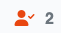

To unjoin the event, the user will just need to re-click or re-tap.

``USER STORY - As a Site user I can leave comments on single event pages, so that I can interact with other site users``

**Leaving Comments**

Authenticated users can leave comments: Staff users get their comments approved as soon as they submit them, standard users need to wait for approvals instead:

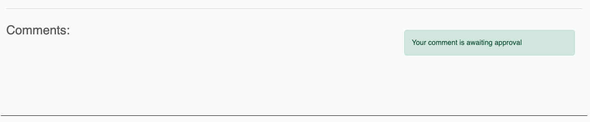

While comments are styled as follows when these have been approved:

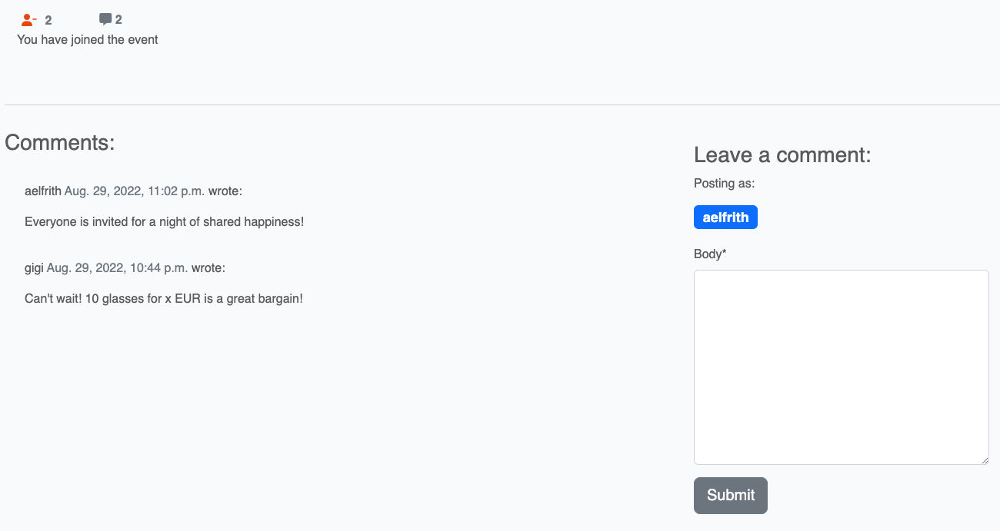

A badge confirms the username of the person who is leaving a comment, while the icon about comments indicate the quantity of those approved and listed beneath it.

``USER STORY - As a site user I can receive a notification banner at the top when an action was performed/processed successfully, so that I can have certainty of submitted data``

**Notifications and Banners**

Users will get notifications based on their actions on the website. Integrated features - for the time being - include authentication and event-creation-editing validation. Examples as follows:

``USER STORY - As a Site user I can suggest an event, so that I can feel involved in the local community``

**Event creation and validation**

All authenticated users can suggest events and submit them for review to the staff. There are a few requirements to submit a request successfully:

* The chosen date should not overlap with other events 
* The chosen date should allow 14 days to the staff from the time of submission, to let them assess feasibility and organize everything on time

Once the authenticated user clicks/taps on the navigation menu item "Suggest an event", they are redirected to a new page, where to submit the suggestion:

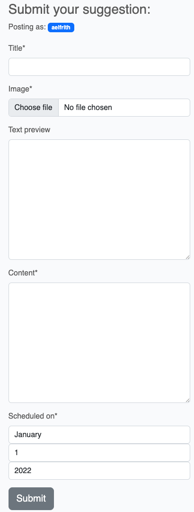

``USER STORY - As a site authenticated user I can suggest events and get warnings when I am trying to submit an overlapping event, so that I get more chances to see my suggestion approved``

Once the form is ready with all data (compulsory fields are marked with an asterisk), the user can click on the button "Submit" and wait for the outcome of their suggestion. The latter will be notified by the banners pasted above, however, users will also come across warnings instructing on minimum requirements to successfully submit an event. Trying to suggest an event the same day of one of those listed in the home page will return a warning banner.

``USER STORY - As a site admin or privileged user (part of the staff) I can edit events, so that I can organize them better.``

``USER STORY - As a site admin or privileged user (part of the staff) I can delete events, so that get rid of unwanted records in the database.``

**Event manipulation**

Staff users can edit or delete events:

* Buttons "Edit" and "Delete" show up next to each event within the home page, if the user is authenticated and is part of the staff.
* Editing the date of the event will require to allow at least 5 days to the staff, to let them assess the feasibility and further arrangements.
* Deletion request will be successful only upon confirmation.

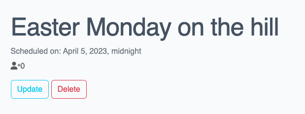

``USER STORY - As a Site Admin I can create, read, update posts, so that I can manage my blog content.``

**Admin CRUD functionality**

Currently, the CRUD functionality is granted to the admin/staff user via separate areas on the website:

* "Suggest an Event" lets all authenticated users create events
* The home page lets all users see the list of scheduled events
* Edit buttons let the staff edit details of the events
* Delete buttons let the staff delete events from the database, upon confirmation

### Features Left To Implement

In the future, some obvious adjustments both in technical and UX terms will be applied. For example:
* Admins/Staff will have a dedicated dashboard where to perform all CRUD actions, without the need of moving from page to page;
* Thinking about deleting data from the database, events can be cancelled, rather than deleted, hence, the feature will be added and prioritized, to also let users know which events have been cancelled;
* Timestamps and time submission will be optimized to improve the UX and readibility. The current project focused on understanding and implementing essential CRUD notions, rather than researching Jinja adaptations of specific features;
* The general appearance will be better developed;
* Notification banners will disappear automatically after 6 seconds, as originally set, however, the function was removed when - after several attempts of refactoring - the .close()-related error message persisted within the browser console. In this sense, troubleshooting of this console error is postponed.
* Users will have the chance to review their submissions, even though limited permissions will be granted, to ease the administration effort in case of short notices;
* Information about location won't be added to the current Event model, even though initially taken into consideration: The NGO is based in Supersano, it arranges events located always in a limited area, points of interest are widely known among local people, hence, defining the location within the description will suffice.
* Event updates need to be refactored via UpdateEvent view, as these should allow at least 5 days from originally_scheduled_on. Currently, the admin can create an event allowing at least 14 days, then, they can edit it immediately and set the new scheduled_on value to moment_of_submission + 5 days, instead of 14 at least. This workaround is allowed to staff users only, hence, it is not drastically affecting UX, given the responsibility that staff has got on managing events.

``USER STORY - As an admin user I can leave internal notes about events, so that I can come up with suggestions about future events``

This user story is not currently implemented, as it was marked as "Could have". It would be nice having a sort of internal interactions within single event overviews, to let the staff discuss about to-dos etc. This will not affect the current models/tables of the database, that were designed with this feature in mind. The field "audience" will distinguish the target of the comments between "admin" and "everyone" (default).

## The-Skeleton-Plane

### Wireframes

The website was designed with responsiveness in mind, however, wireframing was meant to get a general idea of the first impression, hence, mobile wireframing is not available. There are tiny errors within the menu items depicted, as authenticated sessions change the content of the navbar.

* Home Page

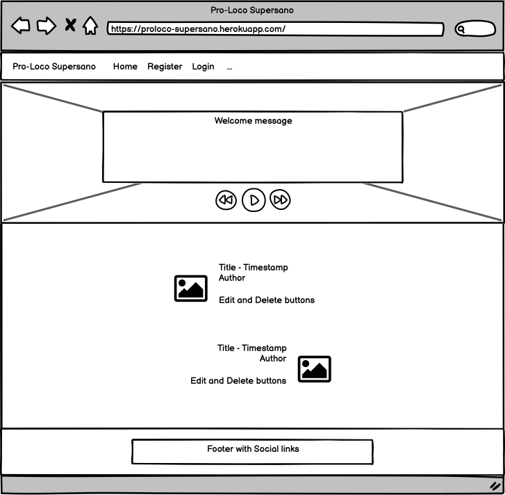

* Event Overview

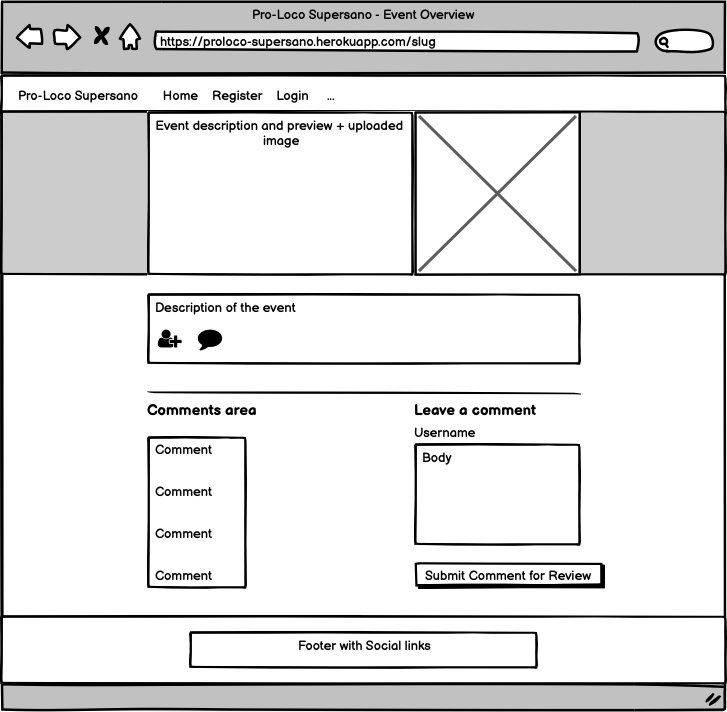

* Event Update

* Event Deletion

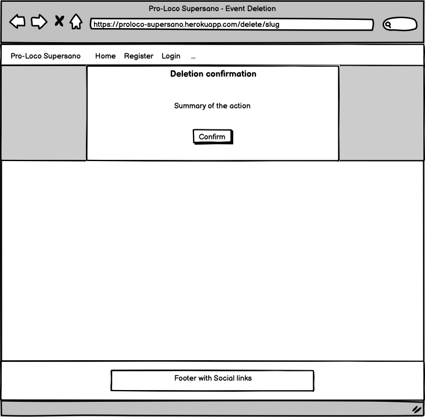

* Event Suggestion

* Account Registration

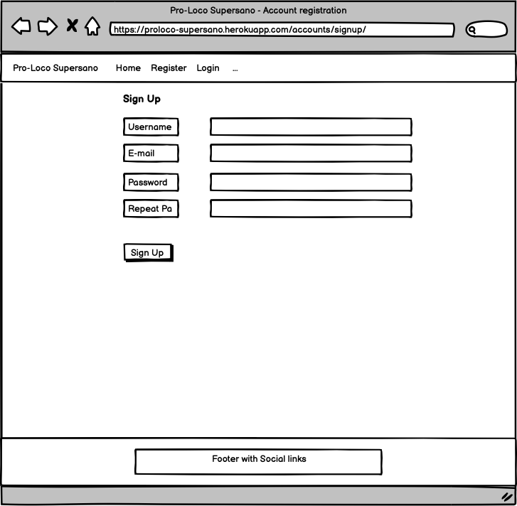

* Account Logout

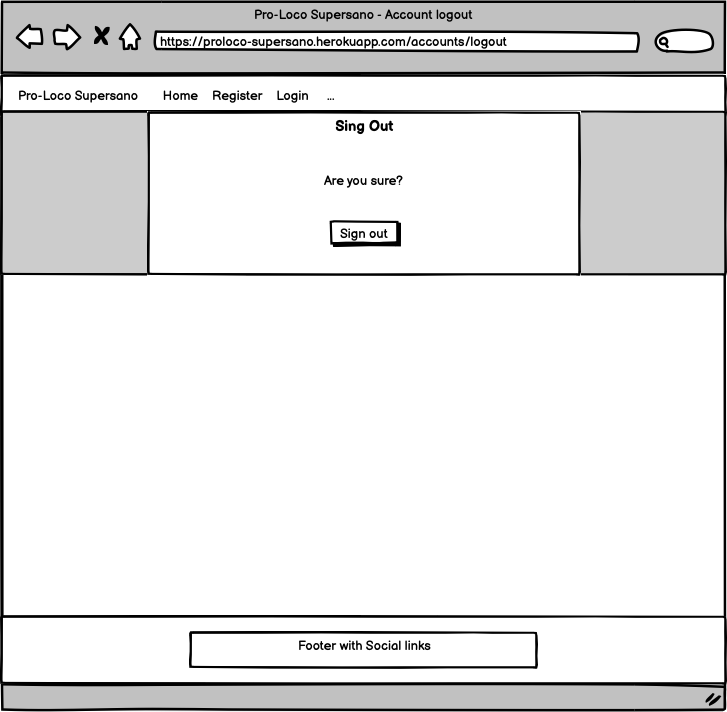

There are obvious tiny changes in the final product. Errors 403, 404, 500 pages were designed following the same layout of the Event Deletion wireframe.

### Database-Design

The database was designed to allow CRUD functionality to be available to registered users, when signed in. The user model plays a crucial role in handling authentication, provided by Django. Enhanced user permissions were designed based on the user.is_staff boolean field, as it is intended to distinguish the admin role as user.is_superuser from staff members as user.is_staff. This way, future changes may for example grant special permissions to admins that intend to delete records from the database (superuser), instead of just cancelling an event (staff). Further information about this model can be found on [Django](https://docs.djangoproject.com/en/4.1/ref/contrib/auth/).

The Event model includes information about the User who created/suggested the event, linked via a one-to-many relationship to the User model - as a foreign key then - mentioned above, under the field "author". Moreover, if one author is being deleted from the database, events created by that author will be deleted as well. 

The "joins" field returns information about the users that clicked/tapped on the join button, to confirm they will join a given events. In this sense, "join" is a many-to-many field, because an event can have multiple "joins" left by multiple users.

The Comment model presents a foreign key like the one above, in relation to the event it has been attached to. If an event is being deleted from the database, the attached comments will be deleted too. Finally, the field "audience" will determine the audience that the comment is meant for, however, as specified above, this feature will be implemented in the future.

Entity relationship diagram was created using [LucidChart](https://lucid.app/) and shows the schemas for each of the models and how they are related.

### Security

Views were secured by using the django class-based view mixin, UserPassesTextMixin. A test function was created to use the mixin and checks were ran to ensure that the user who is trying to access the page is authorized. Any staff restricted functionality, user edit/delete functionality listed in the features was secured using this method.

Environment variables were stored in an env.py for local development for security purposes to ensure no secret keys, api keys or sensitive information was added the the repository. In production, these variables were added to the heroku config vars within the project.

## The-Surface-Plane
### Design

### Colour-Scheme

The website is based on the BS5 template available [here](https://getbootstrap.com/docs/5.0/examples/carousel/). The present project has not focused on graphical effects or consistent colour palettes for a number of reasons, rather, essential style features have been quickly implemented thanks to Bootstrap 5. However, it is possible to observe a basic colour transition effect via css, when hovering on Event cards in the homepage.

EXTERNAL CODE: Some classes were added directly from a previous walkthrough project, considered a nice fit. Moreover, the hovering effect and colour transition were retrieved from the following sources, later customized according to the project needs:

[Gradient Animator](https://www.gradient-animator.com/)

[Card Hovering Effect](https://freefrontend.com/css-card-hover-effects/)

### Typography

The Roboto, Lato fonts were used throughout the website. Source [Google Fonts](https://fonts.google.com/)

### Imagery

Images uploaded on Cloudinary and visible on the website were retrieved from [Pro Loco Supersano - Facebook](https://www.facebook.com/prolocosupersano2018). 

## Technolgies

- HTML
  - The structure of the Website was developed using HTML as the main language.
- CSS
  - The Website was styled using custom CSS in an external file.
- JavaScript
  - JavaScript was used, even though via cdn only.
- Python
  - Python was the main programming language used for the application using the Django Framework.
- Gitpod
  - The website was developed using Gitpod IDE
- GitHub
  - Source code is hosted on [GitHub](https://github.com/aelfrith92/pro-loco-milestone-project-4)
- Git
  - Used to commit and push code during the development of the Website
- Font Awesome
  - This was used for various icons throughout the site
- Favicon.io
  - favicon files were created at https://favicon.io/favicon-converter/
- balsamiq
  - wireframes were created using balsamiq from https://balsamiq.com/

**Python Modules Used**

* Django Class based views (ListView, UpdateView, DeleteView, CreateView) - Used for the classes to create, read, update and delete
* Mixins (LoginRequiredMixin, UserPassesTestMixin) - Used to enforce login required on views and test user is authorized to perform actions
* messages - Used to pass messages to the toasts to display feedback to the user upon actions
* timedelta - timedelta was used to add x days to the timestamp of submission and perform due checks

**External Python Modules**

* python3-openid==3.2.0 - Installed as dependency with another package
* requests==2.27.1 - Installed as dependency with another package
* requests-oauthlib==1.3.1 - Installed as dependency with another package (allauth authentication)
* six==1.16.0 - Installed as dependency with another package
* sqlparse==0.4.2 - Installed as dependency with another package
* tzdata==2022.1 - Installed as dependency with another package
* urllib3==1.26.9 - Installed as dependency with another package
* whitenoise==6.2.0 - Used to serve static files directly without use of static resource provider like cloundinary

* asgiref==3.5.2 - Installed as dependency with another package
* cloudinary==1.29.0 - Cloundinary was set up for use
* crispy-bootstrap5==0.6 - This was used to allow bootstrap5 use with crispy forms
* dj-database-url==1.0.0 - Used to parse database url for production environment
* dj3-cloudinary-storage==0.0.6 - Storage system to work with cloudinary
* Django==3.2.15  - Framework used to build the application (LTS)
* django-allauth==0.51.0 - Used for the sites authentication system, sign up, sign in, logout, password resets ect.
* django-bootstrap-datepicker-plus==4.0.0 - Initially installed to style the datepicker, later replaced by built-in Django widgets
* django-crispy-forms==1.14.0 - Used to style the forms on render
* django-summernote==0.8.20.0 - Initially installed for text customization, however, later replaced to avoid html parsing
* gunicorn==20.1.0 - Installed as dependency with another package
* heroku==0.1.4 - Heroku CLI to troubleshoot deployment issues
* html2text==2020.1.16 - Initially installed to handle the summernote text (prepopulated fields), later avoided
* oauthlib==3.2.0 - Installed as dependency with another package
* psycopg2==2.9.3 - Needed for heroku deployment
* PyJWT==2.4.0 - Installed as dependency with another package
* python-dateutil==1.5 - Initially installed to handle timestamps, later avoided
* python3-openid==3.2.0 - Installed as dependency with another package
* pytz==2022.1 - Installed as dependency with another package
* requests-oauthlib==1.3.1 - Installed as dependency with another package (allauth authentication)
* sqlparse==0.4.2 - Installed as dependency with another package

## Testing

## Functional Testing

**Authentication**

Description:

Ensure a user can sign up to the website

Steps:

1. Navigate to [Pro-Loco Supersano](https://proloco-supersano.herokuapp.com/) and click Register
2. Enter email, username and password 
3. Click Sign up

Expected:

The user gets errors in case of invalid passwords (i.e. temporary) or existing username, depending on Django's security measures. (Django-allauth-handled)

The user gets logged in as soon as they enter valid information. (Django-allauth-handled)

A green banner confirming authentication also shows up. (Django-messages-handled)

Actual: 

The user gets errors in case of invalid passwords (i.e. temporary) or existing username, depending on Django's security measures. (Django-allauth-handled)

The user gets logged in as soon as they enter valid information. (Django-allauth-handled)

A green banner confirming authentication also shows up. (Django-messages-handled)

Description:

Ensure a user can log in once signed up

Steps:
1. Navigate to [Pro-Loco Supersano](https://proloco-supersano.herokuapp.com/) and click Login
2. Enter login details created in previous test case
3. Click login

Expected:

User is successfully logged in and redirected to the home page (Django-allauth-handled)

Actual:

User is successfully logged in and redirected to the home page (Django-allauth-handled)

Description:

Ensure a user can sign out

Steps:

1. Login to the website
2. Click the logout button
3. Click confirm on the confirm logout page

Expected:

User is logged out (Django-allauth-handled)

Actual:

User is logged out (Django-allauth-handled)

**Event CRUD functionalities**

Description:

Ensure a new event can be created (staff and non-staff) 

Steps:

1. Navigate to [page](https://proloco-supersano.herokuapp.com/suggestE/) - Log in if prompted.
2. Enter the following:
    - Title: Un libro in masseria (Reading in a farmhouse)
    - Download the poster from this [link](https://res.cloudinary.com/aelfrith/image/upload/v1662057247/Un_Libro_in_Masseria_2021_cndn3b.jpg) and choose it locally as "Image"
    - Text Preview: Several authors will present their last books to the audience 
    - Content: Join us at Le Stanzie, a picturesque venue that welcomes hundreds of people every year. The authors will go through their presentations and discuss about several topics with the audience. Enjoy the sorrounding calm and genuine silence of a Sourthern Italian countryside. Aperitivo willl be served afterwards.
3. Scheduled on: any date starting at least 14 days after the moment of submission, i.e. if you are submitting on 01/09/2022, allow 14 days for a successful submission, namely, 15/09/2022 onwards.
4. Click or tap on "Submit"

Expected:

Form successfully submits and a message is shown to alert the user of successful submission.

Actual:

Form successfully submits and a message is shown to alert the user of successful submission.

 

Description:

Ensure an event can be edited.

Steps:

1. Navigate to [page](https://proloco-supersano.herokuapp.com/) - Log in (staff level credentials provided at the time of milestone-project-4 submission)
2. Click or tap "Update" next to any event.
3. Enter the following:
    - Title: [Edit the title as you like]
    - Change the image with any of your choice
    - Text Preview: [Edit the text preview as you like] 
    - Content: [Edit the content as you like]
4. Scheduled on: any date starting at least 5 days after the moment of submission, i.e. if you are submitting on 01/09/2022, allow 5 days for a successful submission, namely, 06/09/2022 onwards. The validation takes also seconds into accounts, for this reason, it is advisable to submit a +6 date- This feature will be improved in future.
5. Click or tap on "Submit"

Expected:

Form successfully submits and a message is shown to alert the user of successful update.

Actual:

Form successfully submits and a message is shown to alert the user of successful update.

Description:

Ensure user can successfully delete an event. 

Steps:

1. Navigate to [page](https://proloco-supersano.herokuapp.com/) - Log in (staff level credentials provided at the time of milestone-project-4 submission)
2. Click or tap "Delete" next to any event.
3. Confirm

Expected:

Booking is successfully deleted

Actual:

Booking is successfully deleted

**Unauthorized actions - 403**

Description:

Prevent unauthorized users from performing staff-level actions.

Steps:

1. Navigate to [page](https://proloco-supersano.herokuapp.com/) - Log in (Use the credentials created above via registration)
2. Enter the following url into the browser address bar: https://proloco-supersano.herokuapp.com/update/la-grande-guerra-del-salento

What is happening: You are trying to update an event without staff-level permissions

Expected:

403 error returned

Actual:

403 error returned

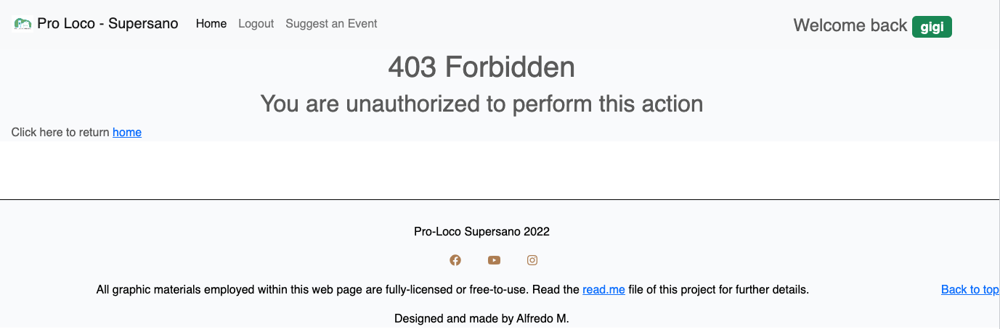

**Page not found - 404**

Description:

Ensure better UX for users visiting pages that do not exist.

Steps:

1. Navigate to [page](https://proloco-supersano.herokuapp.com/this-page-does-not-exist)

What is happening: You are trying to visit a page that does not exist

Expected:

404 error returned

Actual:

404 error returned

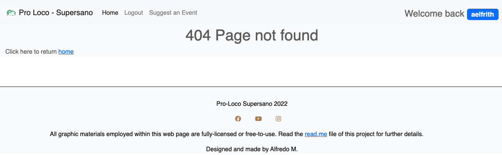

**Internal server error 500**

Description:

Ensure better UX for users getting server errors.

Steps:

1. Navigate to [page](https://proloco-supersano.herokuapp.com/update/qualcosa) - Log in (staff level credentials provided at the time of milestone-project-4 submission)
2. Inspect the code
3. Add an option to the "select" tag presenting the id "id_scheduled_on_year", value attribute set to "2024", innerText set to "2024". Then, select "2024" as year of the event.

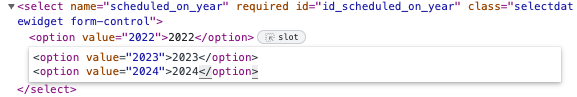

4. Fill the rest as you like
5. Click or tap on "Submit"

What is happening: This test was facilitated via the EventUpdate view, but - generally speaking - this sort of checks - integrated as conditional statements - will be changed to error-handling code format. For the time being, something deceitful is just being handled.

Expected:

500 error returned for demo purposes

Actual: 

500 error returned for demo purposes

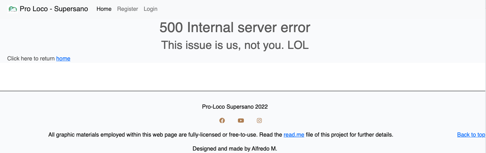

## Negative Testing

Tests were performed on the create booking to ensure that:

1. A user cannot create a date in the past
2. A user cannot create an event on the same dates that others are scheduled on
3. A user cannot update events too far in the future (2024 onwards)
4. Forms cannot be submitted when required fields are empty + other Django-based checks